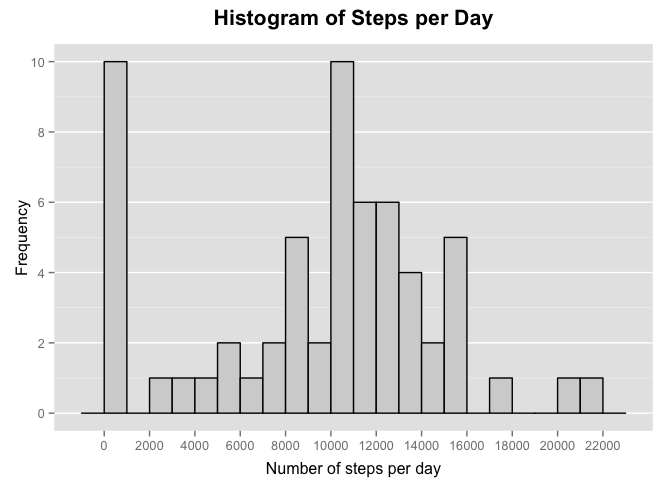
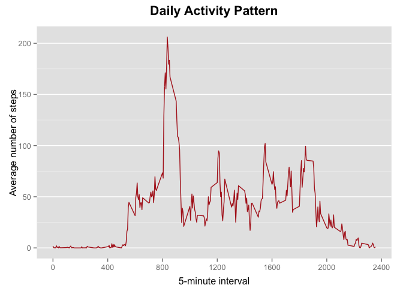
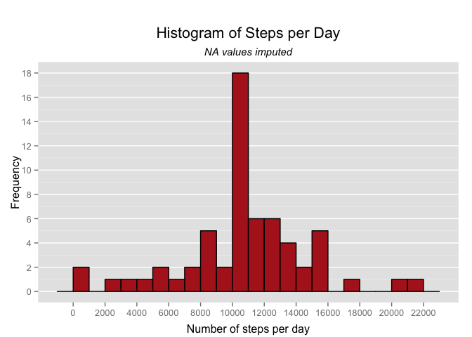

# Reproducible Research: Peer Assessment 1


## Loading and preprocessing the data

For loading the data, we  assume that the original `activity.zip` file is present in the current working directory - no further checks are performed. The data is loaded into a dataframe and the `date` variable is transformed into a *date* object:


```r
# Load dplyr package for data munging;
# use "suppressMessages" to avoid messy output
suppressMessages(require(dplyr))

unzip("activity.zip")
stepdata <- read.csv("activity.csv", stringsAsFactors = FALSE)

stepdata <- stepdata  %>%
              mutate(date = as.Date(date))
```


## What is mean total number of steps taken per day?

We first summarize the total number of steps taken per day, and produce a histogram
to show the distribution:


```r
# Load ggplot2 package for all visualizations;
# use "suppressMessages" to avoid messy output
suppressMessages(require(ggplot2))

stepsPerDay <- stepdata %>%
                  group_by(date) %>%
                  summarize(totalSteps = sum(steps, na.rm = TRUE))

hist <- ggplot(stepsPerDay, aes(totalSteps)) + 
        geom_histogram(binwidth=1000, fill="lightgray", color="black") +
        labs(title = "Histogram of Steps per Day",
             x = "Number of steps per day",
             y = "Frequency") +
        theme(plot.title = element_text(size=16, face="bold", vjust=2),
              axis.title.x = element_text(vjust=-0.35),
              axis.title.y = element_text(vjust=0.35),
              panel.grid.minor.x = element_blank(),
              panel.grid.major.x = element_blank()) +
        scale_x_continuous(breaks=seq(0, 22000, by = 2000)) +
        scale_y_continuous(breaks=seq(0, 10, by = 2))
hist
```

 

We then calculate the **mean** and **median** values for the number of steps taken
per day:


```r
meanSteps <- stepsPerDay %>%
                summarize(mean(totalSteps))
medianSteps <- stepsPerDay %>%
                summarize(median(totalSteps))
```

The resulting values are:

- Mean number of steps per day: 9354.23
- Median number of steps per day: 10395

## What is the average daily activity pattern?

Contrary to the analysis above, we now summarize the original dataset by the
*interval* variable, dropping the date information on the way and calculating the mean of
every 5-minute-interval to reveal an averaged daily pattern of steps, visualized
in a time series plot:


```r
dailyPattern <- stepdata %>%
                  group_by(interval) %>%
                  summarize(meanSteps = mean(steps, na.rm = TRUE))

patt <- ggplot(dailyPattern, aes(interval, meanSteps)) +
          geom_line(color="firebrick") +
          labs(title = "Daily Activity Pattern",
               x = "5-minute interval",
               y = "Average number of steps") +
          theme(plot.title = element_text(size=16, face="bold", vjust=2),
                axis.title.x = element_text(vjust=-0.35),
                axis.title.y = element_text(vjust=0.35),
                panel.grid.minor.x = element_blank(),
                panel.grid.major.x = element_blank()) +
          scale_x_continuous(breaks=seq(0, 2400, by = 400))
patt
```

 

We filter the daily pattern for the **maximum** of the averaged number of steps
across all days:


```r
maxInterval <- dailyPattern %>%
                  top_n(1, meanSteps)
```

The time interval with the maximum number of average steps across all days is
835.

## Imputing missing values

Going back to the original dataset, we report the number of `NA`s in the *steps*
variable of this dataset:


```r
rowsNA <- stepdata %>%
            filter(is.na(steps)) %>%
            count
```

The number of `NA` rows in the dataset is 2304.

To impute missing values into the dataset, we assume that the daily activity
patterns are sustainable and that the `NA` values are introduced into the original
dataset by the person simply not wearing the tracking device. If this is true,
the assumption that the person might still be following their general activity
patterns for that particular time of the day / interval seems reasonable.


```r
# Combine the original dataset and the dailyPattern dataset to have a
# "fallback" value available in case the original dataset contains NA,
# then decide whether to use the original or the fallback value. Finally,
# round the steps variable and get back to an integer type to reflect that only
# a full number of steps can be performed by an individual.
stepdataImputed <- stepdata %>%
                      left_join(dailyPattern, by = "interval") %>%
                      transmute(steps = ifelse(is.na(steps), meanSteps, steps),
                                date = date,
                                interval = interval) %>%
                      mutate(steps = as.integer(round(steps)))
```

On this new dataset, we essentially repeat the calculations performed in section
**What is mean total number of steps taken per day?** and display a revised
histogram on the new dataset:


```r
stepsPerDayImp <- stepdataImputed %>%
                    group_by(date) %>%
                    summarize(totalSteps = sum(steps, na.rm = TRUE))

histImp <- ggplot(stepsPerDayImp, aes(totalSteps)) + 
          geom_histogram(binwidth=1000, fill="firebrick", color="black") +
          labs(title = expression(atop("Histogram of Steps per Day",
                                       atop(italic("NA values imputed")))),
               x = "Number of steps per day",
               y = "Frequency") +
          theme(plot.title = element_text(size=16, face="bold", vjust=-1),
                axis.title.x = element_text(vjust=-0.35),
                axis.title.y = element_text(vjust=0.35),
                panel.grid.minor.x = element_blank(),
                panel.grid.major.x = element_blank()) +
          scale_x_continuous(breaks=seq(0, 22000, by = 2000)) +
          scale_y_continuous(breaks=seq(0, 50, by = 2))
histImp
```

 


## Are there differences in activity patterns between weekdays and weekends?
